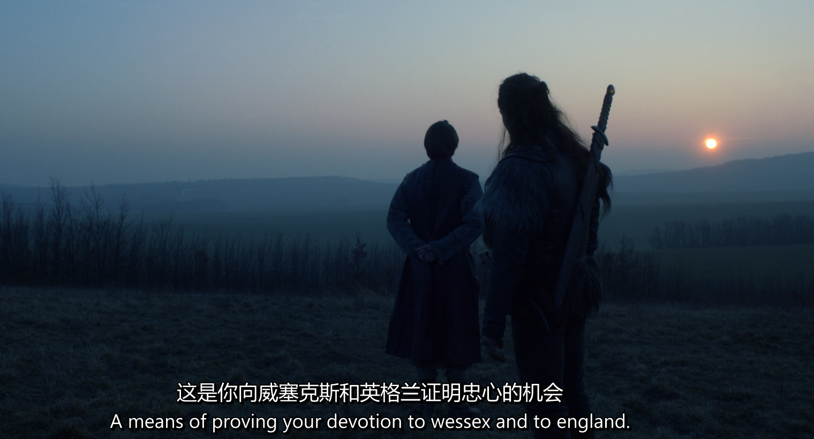
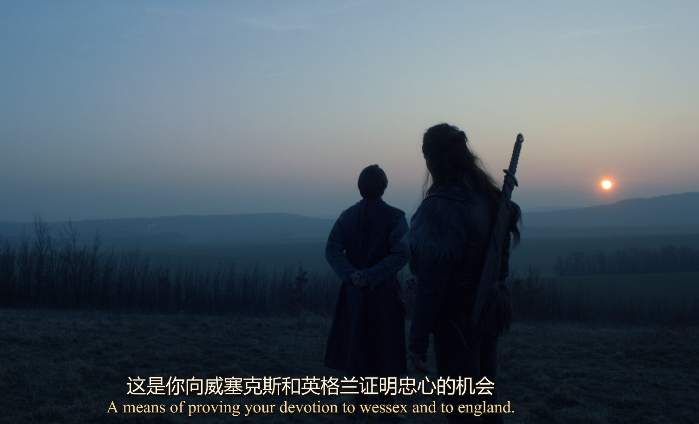
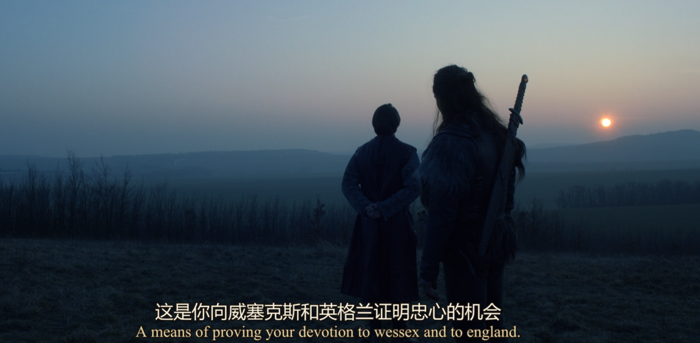

# 《孤国春秋》字幕双语处理工具 使用说明

一套把《孤国春秋》(The Last Kingdom) 英文字幕做成**中上英下**双语字幕, 并进一步
转成带样式的 ASS、最终封装成蓝光 PGS `.sup` 的完整工具链, 供个人英语学习使用。

整体流程分三步 (每一步都可单独使用):

1. **翻译**: `translate_srt.py` — 英文 SRT → 中上英下 双语 SRT
2. **加样式**: `srt2ass.py` — 双语 SRT → 带中英不同字体/颜色的 ASS
3. **封装**: `ass2sup.py` — ASS → 蓝光 PGS 图形字幕 `.sup` (保留全部视觉效果)

时间戳和行号在翻译阶段原样保留, 不改动。

---

## 一、准备工作 (只需做一次)

### 1. 确认 Python
```powershell
python --version
```
需要 Python 3.8 以上。没有的话去 https://www.python.org 装。

### 2. 安装依赖
```powershell
python -m pip install openai
```

### 3. 准备一个大模型 API
脚本使用 **OpenAI 兼容接口** 调用大模型。任何兼容 OpenAI 接口的服务 (官方、
各类中转、或本地部署) 都可以使用, 只需拿到三样东西:

- **API Key**: 平台颁发的密钥
- **Base URL**: 服务的接口地址
- **模型名**: 要调用的模型标识

去所选平台注册, 拿到 API Key 后即可。

---

## 二、配置 (每次开新的 PowerShell 窗口都要设一次)

在 PowerShell 里设置三个环境变量:
```powershell
$env:LLM_API_KEY  = "你的API Key"
$env:LLM_BASE_URL = "你的接口地址"
$env:LLM_MODEL    = "你的模型名"
```

**想一劳永逸 (永久保存, 不用每次设):**
```powershell
[Environment]::SetEnvironmentVariable("LLM_API_KEY",  "你的API Key", "User")
[Environment]::SetEnvironmentVariable("LLM_BASE_URL", "你的接口地址", "User")
[Environment]::SetEnvironmentVariable("LLM_MODEL",    "你的模型名", "User")
```
设完 **重开一个 PowerShell 窗口** 才生效。

---

## 关于路径 (三个脚本通用)

**脚本和字幕不必放在同一目录**。所有脚本都通过命令行参数接收文件路径,
既可以用完整路径, 也可以用相对当前目录的路径。下面示例为了简洁写成短文件名,
实际使用时把它换成你的真实路径即可, 例如:

```powershell
# 用完整路径 (脚本、字幕可在任意位置)
python "脚本所在路径\translate_srt.py" "字幕所在路径\字幕.srt"

# 或先进入脚本所在目录, 再用相对路径
cd "脚本所在目录"
python translate_srt.py "字幕所在路径\字幕.srt"
```

> 路径里有空格时记得用引号包起来。

---

## 三、第一步:翻译 (translate_srt.py)

### 场景 A: 翻单集
```powershell
python translate_srt.py "字幕.srt"
```

### 场景 B: 翻整季 (自动处理文件夹里所有 .srt)
把整季的 `.srt` 都放进同一个文件夹, 然后:
```powershell
python translate_srt.py --batch "字幕所在文件夹"
```
> 已经生成过的 `.zh-en.srt` 会被自动跳过, 不会重复翻。

### 可选参数
```powershell
# 加大每批条数 (默认 25), 减少请求次数
python translate_srt.py "字幕.srt" --batch-size 40

# 指定术语表位置 (默认在字幕同目录的 glossary.json)
python translate_srt.py "字幕.srt" --glossary "术语表.json"
```

### 输出结果

- 输出文件: 原名后加 `.zh-en`, 例如 `字幕.zh-en.srt`
- 原字幕文件 **不会被改动**。
- 每条固定两行, **中文在上, 英文在下**:
  ```
  5
  00:00:27,680 --> 00:00:29,444
  丹麦人
  Danes.
  ```
- 译文风格细节:
  - **不显示句号, 结尾也不留逗号** (中文陈述句直接收住; 问号、感叹号正常保留)
  - **中文标点用全角符号** (句中的逗号、问号、感叹号等都是中文全角), 且**不含多余空格**
  - **中英各自铺成一行**: 不管英文原文有几行, 中文和英文都各合并成一行输出;
    即使是两人对话 (原文 `- ` 开头的多行), 也铺成一行, 用 ` - ` 分隔不同说话人
  - **括号内容不翻译** (说话人标记如 `(LORD UHTRED)`、音效如 `(GRUNTING)` 都不出现在中文里)
- 纯音效/纯括号的字幕会只保留英文原文, 不浪费翻译额度。

播放时在播放器 (VLC / PotPlayer 等) 里加载这个 `.zh-en.srt` 即可看到双语。
如果只想要双语 SRT, 到这一步就够了; 想要带样式的字幕或压进蓝光, 继续下面两步。

### 效果预览

<div align="center">

<!-- 把 SRT 双语字幕的效果图放到 images 文件夹, 并改成对应文件名 -->


<sub>SRT 双语字幕效果</sub>

</div>

---

## 四、第二步:加样式转 ASS (srt2ass.py)

把上一步的双语 SRT 转成 ASS。脚本会**自动识别每行是中文还是英文**, 分别套用
不同的样式 (中文用微软雅黑较大字号, 英文用 Times New Roman 较小字号, 颜色也不同),
让中英文在画面上层次分明。

```powershell
python srt2ass.py "字幕.zh-en.srt" "字幕.ass"
```

- 第一个参数是输入的 SRT (双语或任意 SRT 都行), 第二个是输出的 ASS 路径。
- 输出为 1920x1080 画布, 中英两种样式在 ASS 头部的 `[V4+ Styles]` 里定义,
  想改字体/字号/颜色直接编辑脚本里的 `header` 部分即可。

### 效果预览

<div align="center">

<!-- 把 ASS 带样式字幕的效果图放到 images 文件夹, 并改成对应文件名 -->


<sub>ASS 带样式字幕效果 (中英不同字体/颜色)</sub>

</div>

---

## 五、第三步:封装成蓝光 PGS (ass2sup.py)

把带样式的 ASS 用 libass 渲染成图片, 再打包成蓝光原盘用的 PGS 图形字幕 `.sup`,
**完整保留字体、颜色、描边、位置等视觉效果**。适合压制蓝光或做外挂 PGS 字幕。

**前置外部工具** (需自行下载, 并在脚本顶部把路径指向它们):

- `ass2bdnxml.exe` — 把 ASS 经 libass 渲染成 BDN XML + PNG
- `SUPer_CLI.exe` — 把 BDN XML 打包成 `.sup`

脚本顶部的 `ASS2BDNXML` 和 `SUPER_CLI` 两个变量记录这两个 exe 的位置,
移动工具后改这两行即可。

```powershell
# 输出默认与输入同名同目录 (.sup)
python ass2sup.py "字幕.ass"

# 指定输出
python ass2sup.py "字幕.ass" "字幕.sup"

# 指定视频规格与帧率
python ass2sup.py "字幕.ass" -v 1080p -f 23.976
```

常用可选参数:

| 参数 | 含义 | 默认 |
|---|---|---|
| `-v` / `--video-format` | 视频规格 (1080p,1080i,720p,576i,480i) | `1080p` |
| `-f` / `--fps` | 帧率 (23.976,24,25,29.97,50,59.94,60) | `23.976` |
| `-b` / `--bt` | BT 色彩矩阵 (601,709,2020) | `709` |
| `-a` / `--fontdir` | 额外字体目录 (未安装的字体放这里) | 无 |
| `--keep-temp` | 保留中间的 BDN XML + PNG 文件夹 | 否 |

处理过程分两步打印进度 (libass 渲染 → SUPer 打包), 完成后输出 `.sup` 及其大小。

### 效果预览

<div align="center">

<!-- 把 SUP 蓝光图形字幕的效果图放到 images 文件夹, 并改成对应文件名 -->


<sub>SUP 蓝光 PGS 图形字幕效果</sub>

</div>

---

## 六、术语表 glossary.json — 保证整季专名统一

这是本工具的核心。它记录所有人名、地名、专有名词的统一译法, 例如:

```json
{
  "Uhtred": "乌特雷德",
  "Bebbanburg": "贝班堡",
  "Kjartan": "基尔坦",
  "Eoferwic": "约克",
  "Beocca": "贝奥卡",
  "Wessex": "威塞克斯"
}
```

**它是如何工作的:**
1. 翻译时, 脚本把整张表塞给模型, **强制** 按这个译法翻, 全季一致。
2. 翻译中若出现表里没有的新专名 (后面剧集常有新角色), 模型会自动上报,
   脚本立即写回 `glossary.json`。
3. **翻下一集时会先加载这张表**, 所以 s01e02 里的乌特雷德、贝班堡等
   和 s01e01 完全一致。这就解决了"一集一个译法"的问题。

**你可以手动编辑它:** 用记事本打开 `glossary.json`, 想改哪个译名直接改,
脚本永远以文件里的为准。建议整季从头到尾一直用同一个 `glossary.json`。

---

## 七、翻译风格

脚本已内置《孤国春秋》专属翻译规则 (在 `translate_srt.py` 顶部 `STYLE_RULES`):

- **史诗古典感**: 庄重, 禁现代网络语和商业术语。
- **信仰对立**: 撒克逊基督徒用"天主/主/异教徒/神父"; 维京人用"众神/英灵殿/奥丁/托尔"。
- **战士粗粝**: 对话豪爽直接, `Arseling→浑球`, `Shield wall!→立盾墙!`。
- **经典台词统一**: `Destiny is all → 命运主宰一切`。

想微调风格, 直接编辑 `translate_srt.py` 里的 `STYLE_RULES` 文本即可。

---

## 八、常见问题

**Q: 报错 `未设置 LLM_API_KEY 环境变量`**
第二步的环境变量没设, 或换了新窗口没重设。重新执行第二步。

**Q: 报错 `缺少依赖, 请先运行: pip install openai`**
执行 `python -m pip install openai`。

**Q: 中途某批一直失败**
脚本会自动重试 3 次。仍失败通常是网络或 key/额度问题。已翻好的术语表会保存,
修好后重跑即可 (输出会覆盖重来, 但术语表不丢)。

**Q: 想换更好/更便宜的模型**
只改 `LLM_BASE_URL` 和 `LLM_MODEL` 两个环境变量, 脚本不用动。

**Q: ass2sup.py 报找不到 exe**
脚本顶部的 `ASS2BDNXML` / `SUPER_CLI` 路径没指对。下载好这两个外部工具后,
把这两行改成它们的实际位置。

**Q: 花费大概多少**
一集约 700 条对白, 单集成本通常在几毛到一两元人民币量级 (取决于所选服务定价),
属于很低的水平。

---

## 文件清单

| 文件 | 作用 |
|---|---|
| `translate_srt.py` | 第一步:翻译主程序 (英文 SRT → 双语 SRT) |
| `srt2ass.py` | 第二步:双语 SRT → 带中英样式的 ASS |
| `ass2sup.py` | 第三步:ASS → 蓝光 PGS `.sup` (需外部工具) |
| `glossary.json` | 术语表 (自动生成 + 可手动编辑, 跨集复用) |
| `*.zh-en.srt` | 翻译输出的双语字幕 |
| `images/` | 存放文档里的效果图 (srt/ass/sup 预览) |
| `使用说明.md` | 本文档 |


